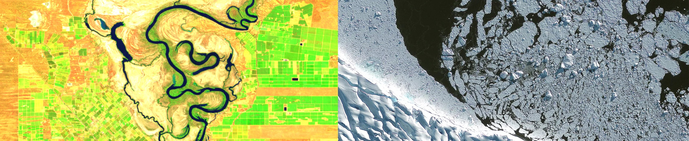

# Geoscience Australia's Sentinel-1 Hackathon

Info on the hackathon here

## Data availability

Geoscience Australia's Sentinel-1 data is published across multiple products, one for each polarisation mode used to capture the data.
You can see the distribution of captured data over time and space in the DEA Dev Explorer:
* [VV+VH distribution](https://explorer.dev.dea.ga.gov.au/products/ga_s1_iw_vv_vh_c0)
* [VV distribution](https://explorer.dev.dea.ga.gov.au/products/ga_s1_iw_vv_c0)
* [HH distribution](https://explorer.dev.dea.ga.gov.au/products/ga_s1_iw_hh_c0)

## Contributing notebooks

Info on how and where to push case-study notebooks during the hack.

## SAR use cases

In the table below we list a number of potential SAR use cases. For the hackathon, you can assign yourself to one of these use case by clicking on the 'assign youself' link, which will take you to the github projects board where you can write you name on the corresponding card.

| SAR data use | SAR requirements | Added value | Scientific maturity and suitability for operationalisation | Assigned to |
|--------------|------------------|-------------|------------------------------------------------------------|-------------|
| **Historical floodwater extent and depth** | Backscatter. VV + VH. C-band. L-band will provide under-canopy inundation. | Value added via observing through clouds and potential to produce a harmonised product. A historical product will inform community preparedness and hazard modelling. | Advanced. An operational dynamic surface water extent algorithm has been developed by NASA/ASF. It is intended to apply this at a 30 m resolution globally (including Aus) to Sentinel 1 A/B scenes. Many other scientific algorithms exist for flood mapping applications. <br>[DSWx Product Suite](https://www.jpl.nasa.gov/go/opera/products/dswx-product-suite) • [HydroSAR](https://github.com/HydroSAR/HydroSAR) • [NASA PROTEUS](https://github.com/nasa/PROTEUS) • [Opera DSWX-SAR](https://github.com/opera-adt/DSWX-SAR) | [Assign yourself](https://github.com/users/cbur24/projects/1) |
| **Ground Displacement** <br>- Ground water <br>- Earthquakes <br>- Volcanic activity <br>- Landslides <br>- Mine displacement | InSAR, pixel offset tracking | Not hazards DEA has immediate interests in investigating. Geodesy team is piloting continental-scale ground line-of-sight displacement. The Community Safety Branch would be interested in earthquake impact tools and possibly landslides. | Advanced. Often requires scientific oversight. In the future the NISAR displacement product could be rolled out over Australia. <br>[DISP Product Suite](https://www.jpl.nasa.gov/go/opera/products/disp-product-suite) | [Assign yourself](https://github.com/users/cbur24/projects/1) |
| **Coastal erosion / shoreline extraction** | Geo-located backscatter. HH is likely the best, and X-Band > L-Band > C-Band for detectability. C-band won’t detect inundation below canopies well. | Different overpass times allow observation of different tides vs optical. Combines sources to increase temporal resolution for models. Improved mapping in cloudy areas. Potential for tidal inundation detection under mangroves. Could remove tidal coverage bias in monsoon cloud areas. | Developed. Algorithms exist but need QC for speckle, rough seas, bright coastal targets. Validation with Landsat/Sentinel-2 needed. Problems may occur at low tide. Sub-aperture interferometric processing may detect waves and delineate shorelines. Wave conditions limits apply. <br>[Sentinel-1 algorithms](https://doi.org/10.3390/jmse11030627) • [Coastline extraction L-band](https://doi.org/10.1080/21664250.2019.1619252) • [Observation geometry L- & X-band](https://doi.org/10.1080/21664250.2018.1560685) | [Assign yourself](https://github.com/users/cbur24/projects/1) |
| **Vegetation mapping and Land-Cover** | Dual-pol or quad-pol backscatter. C-band and L-band. InSAR (coherence) | SAR can determine woody from non-woody vegetation via double-bounce scattering. Coherence improves classification accuracy. | Developed. Proof-of-concepts in QLD show biomass-SAR relationships. More work needed for integration into classifiers. <br>[Multi-sensor classifier](https://doi.org/10.1016/j.jag.2020.102209) • [Structural classification](https://doi.org/10.3390/rs11020147) • [Crop mapping](https://doi.org/10.3390/rs13163300) | [Assign yourself](https://github.com/users/cbur24/projects/1) |
| **Forest Stand Height** | InSAR (interferometry) | Provides age/history of forest, habitat info, biomass monitoring. Estimated by combining repeat-pass InSAR with DEM. | Developed. Applied to large-scale mosaics. <br>[Forest height mapping](http://dx.doi.org/10.3390/rs70505639) | [Assign yourself](https://github.com/users/cbur24/projects/1) |
| **Flood mapping and wetlands** | Single-pol (HH) backscatter. C- and L-band. InSAR (coherence, interferometry) | Real-time mapping done by Community Safety Branch (ICEYE). Longer-term DEA monitoring possible. SAR backscatter can separate water and land; coherence helps map wetland vegetation. L-band penetrates canopy. | Developed. Used RADARSAT-2 for flood/wetland mapping. Challenges include coherence loss and atmospheric phase delay. <br>[Review paper](https://doi.org/10.1080/07038992.2018.1477680) | [Assign yourself](https://github.com/users/cbur24/projects/1) |
| **Urban cover** | Dual-pol or quad-pol backscatter. C-band and L-band | Improves distinction between urban and bare land vs optical alone. Structural insights from polarimetry. | Developed. Many proofs-of-concept and global mapping efforts. <br>[SAR+Optical mapping](https://doi.org/10.1186/s40068-023-00324-5) • [Sentinel-1+2 workflow](https://doi.org/10.3390/rs14010036) • [OpenSARUrban dataset](https://doi.org/10.1109/JSTARS.2019.2954850) • [DEA Africa Notebook](https://docs.digitalearthafrica.org/en/latest/sandbox/notebooks/Real_world_examples/Radar_urban_area_mapping.html) | [Assign yourself](https://github.com/users/cbur24/projects/1) |
| **Coastal habitat separation** | Backscatter, all polarisations C- and L-band. InSAR/Top-of-canopy DEM | Potential to distinguish saltmarsh, mangrove, supratidal habitats based on canopy height and backscatter. | Experimental. No established algorithm; NISAR quad-pol may help. Fusion with optical enhances results. <br>[Mangrove polarimetry](https://doi.org/10.3390/rs70708563) • [Inundated vegetation classification](https://doi.org/10.1016/j.rse.2021.112864) | [Assign yourself](https://github.com/users/cbur24/projects/1) |
| **Historical burn area mapping** | Backscatter, VV + VH. C-band. L-band can observe under-canopy fires. | Detects burns under canopy, through clouds/smoke. Informs preparedness and hazard modelling. | Experimental. Difficult to map accurately at large scales; requires ML and change detection tuned to vegetation/landscape type. <br>[Burn area mapping](https://doi.org/10.1071/WF23124) | [Assign yourself](https://github.com/users/cbur24/projects/1) |
| **Crop classification and yields** | Dual-pol or quad-pol backscatter + coherence. Time series/change detection. C-band | Could enhance DEA land-cover agriculture information. | Experimental. Successful in Wales (Sentinel-1) but coverage higher than Australia’s. <br>[Living Wales approach](https://doi.org/10.3390/rs13050846) | [Assign yourself](https://github.com/users/cbur24/projects/1) |
| **Soil Moisture** | Backscatter and emissivity | No known DEA value add. | Operational product exists — ESA CCI daily active+passive SAR soil moisture product. <br>[ESA CCI Soil Moisture](https://climate.esa.int/en/projects/soil-moisture/) | [Assign yourself](https://github.com/users/cbur24/projects/1) |

## External resources

### SAR theory
Links to lectures or other content explaining SAR principles.

### Existing notebooks
Links to existing python scripts or jupyter notebooks
* [ASF OpenSARlan](https://github.com/ASFOpenSARlab/opensarlab-notebooks)

## Example data loading

This repository provides examples for how to load data in two ways:
* Using DE's STAC API, which can be run on any computer.
* Using DE's dev Open Data Cube, which is only available in DE's Dev Sandbox environment. 

If you are not a Geoscience Australia employee, you will need to use the STAC API approach.

### STAC API

* [STAC-loading-notebook](notebooks/loading_with_stac.ipynb)

### DE's Dev Open Data Cube (via Dev Sandbox)

* [Datacube-loading-notebook](notebooks/loading_with_datacube.ipynb)

## Environment set up

### Cloning the repository
To access and run the iPython notebooks, you will need to clone this repository into your local computing environment, or the DE Dev Sandbox. 

In a terminal, navigate to where you wish to keep the repository and run
```
git clone https://github.com/cbur24/sentinel-1-hackathon.git
```

### Setting up the environment

If using DEA's Sandbox, no environment set up is required.

If using your own computer to run the STAC API notebook, you will need a Python environment with the required packages. 

You can follow the instructions in the [virtual_env_instructions](virtual_env_instructions.md) to set this up.
